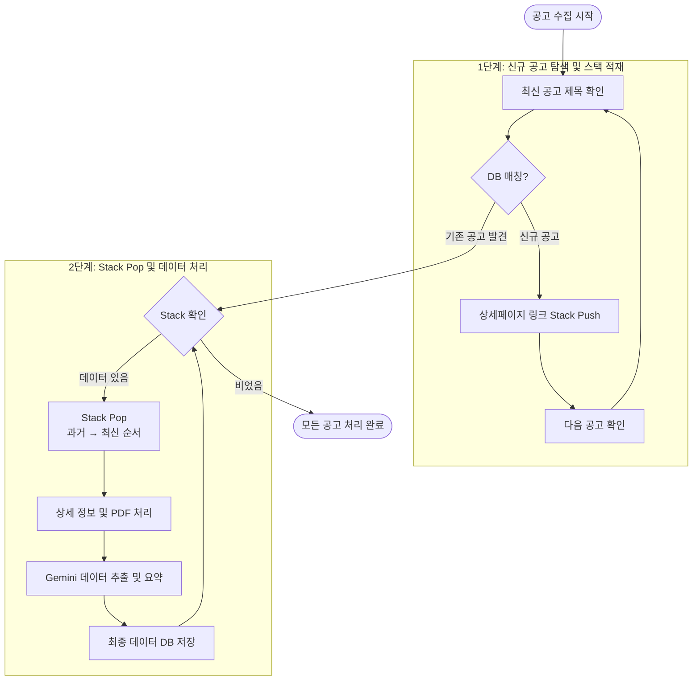
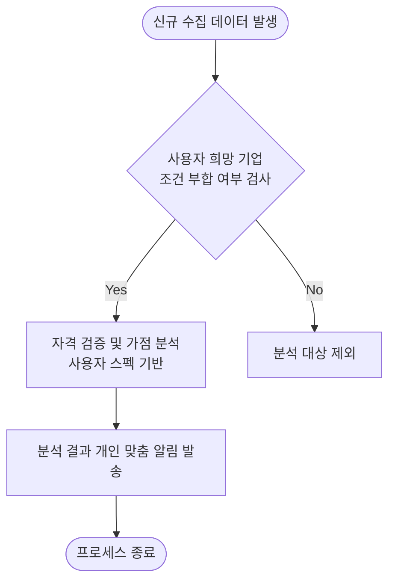

# 핵심 로직 플로우

## 한 줄 요약

잡알리오 채용공고 PDF를 AI가 읽어 핵심 정보를 구조화하고 요약 → 사용자 스펙과 자동 매칭 → 지원 가능 여부와 가점 체크리스트까지 제공

 

### 공고 데이터 수집 플로우

```mermaid
flowchart TD
    Start([공고 수집 시작]) --> GetTitle

    subgraph Discovery [1단계: 신규 공고 탐색 및 스택 적재]
        GetTitle[최신 공고 제목 확인] --> MatchDB{DB 매칭?}
        MatchDB -- "신규 공고" --> PushStack[상세페이지 링크 Stack Push]
        PushStack --> NextAnn[다음 공고 확인]
        NextAnn --> GetTitle
    end

    MatchDB -- "기존 공고 발견" --> CheckStack{Stack 확인}

    subgraph Processing [2단계: Stack Pop 및 데이터 처리]
        CheckStack -- "데이터 있음" --> PopStack[Stack Pop <br/> 과거 → 최신 순서]
        PopStack --> Detail[상세 정보 및 PDF 처리]
        Detail --> Gemini[Gemini 데이터 추출 및 요약]
        Gemini --> SaveDB[최종 데이터 DB 저장]
        SaveDB --> CheckStack
    end

    CheckStack -- "비었음" --> End([모든 공고 처리 완료])
```

### 공고 자동 분석 및 결과 알림

```mermaid
flowchart TD
    NewData([신규 수집 데이터 발생]) --> MatchCondition{사용자 희망 기업<br/>조건 부합 여부 검사}
    MatchCondition -- "Yes" --> Analyze[자격 검증 및 가점 분석<br/>사용자 스펙 기반]
    MatchCondition -- "No" --> Skip[분석 대상 제외]
    Analyze --> SendAlert[분석 결과 개인 맞춤 알림 발송]
    SendAlert --> End([프로세스 종료])
```

